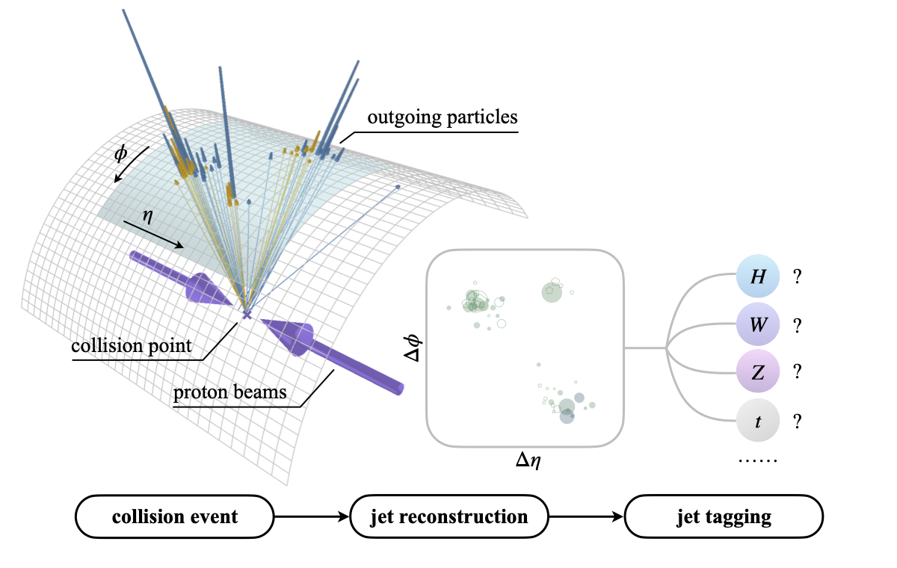
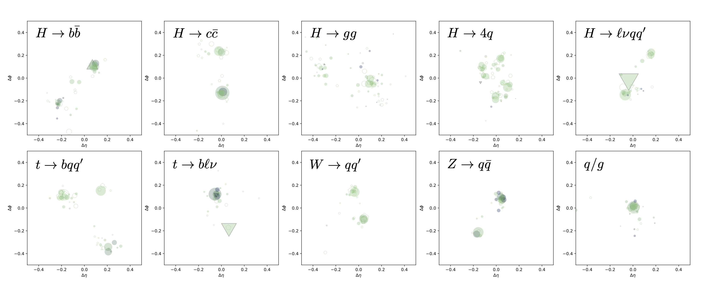
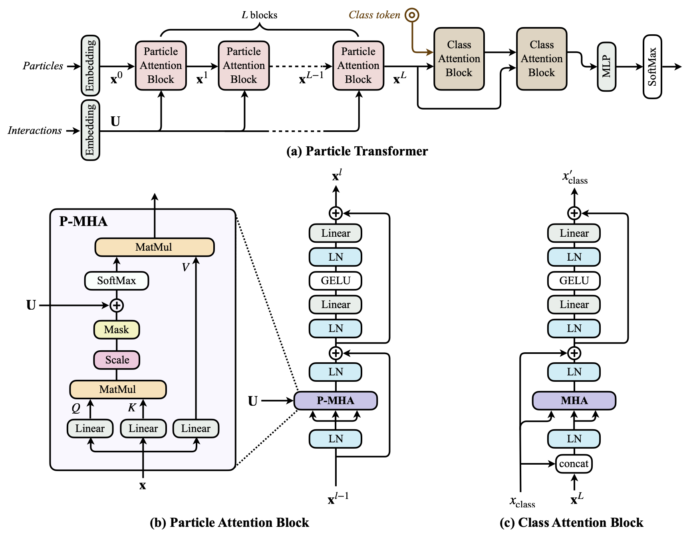

# Particle Transformer

This repo is the implementation of "[Particle Transformer for Jet Tagging](https://arxiv.org/abs/2202.03772)" and its PTQ. It includes the code, pre-trained models, and the JetClass dataset.




## Introduction

### JetClass dataset

**[JetClass](https://zenodo.org/record/6619768)** is a new large-scale jet tagging dataset proposed in "[Particle Transformer for Jet Tagging](https://arxiv.org/abs/2202.03772)". It consists of 100M jets for training, 5M for validation and 20M for testing. The dataset contains 10 classes of jets, simulated with [MadGraph](https://launchpad.net/mg5amcnlo) + [Pythia](https://pythia.org/) + [Delphes](https://cp3.irmp.ucl.ac.be/projects/delphes):



### Particle Transformer (ParT)

The **Particle Transformer (ParT)** architecture is described in "[Particle Transformer for Jet Tagging](https://arxiv.org/abs/2202.03772)", which can serve as a general-purpose backbone for jet tagging and similar tasks in particle physics. It is a Transformer-based architecture, enhanced with pairwise particle interaction features that are incorporated in the multi-head attention as a bias before softmax. The ParT architecture outperforms the previous state-of-the-art, ParticleNet, by a large margin on various jet tagging benchmarks.



## Getting started

### PTQ

``` bash
python ptq_fx_weaver.py
```

### Training

The ParT models are implemented in PyTorch and the training is based on the [weaver](https://github.com/hqucms/weaver-core) framework for dataset loading and transformation. To install `weaver`, run:

```python
pip install 'weaver-core>=0.4'
```

**To run the training on the JetClass dataset:**

```
./train_JetClass.sh ParT [kin|kinpid|full] ...
```

where the first argument is the model:

- ParT: [Particle Transformer](https://arxiv.org/abs/2202.03772)

and the second argument is the input feature sets:

- [kin](data/JetClass/JetClass_kin.yaml): only kinematic inputs
- [kinpid](data/JetClass/JetClass_kinpid.yaml): kinematic inputs + particle identification
- [full](data/JetClass/JetClass_full.yaml) (_default_): kinematic inputs + particle identification + trajectory displacement

Additional arguments will be passed directly to the `weaver` command, such as `--batch-size`, `--start-lr`, `--gpus`, etc., and will override existing arguments in `train_JetClass.sh`.

**Multi-gpu support:**

- using PyTorch's DataParallel multi-gpu training:

```
./train_JetClass.sh ParT full --gpus 0,1,2,3 --batch-size [total_batch_size] ...
```

- using PyTorch's DistributedDataParallel:

```
DDP_NGPUS=4 ./train_JetClass.sh ParT full --batch-size [batch_size_per_gpu] ...
```


The argument `ParT-FineTune` or `PN-FineTune` will run the fine-tuning using [models pre-trained on the JetClass dataset](models/).

